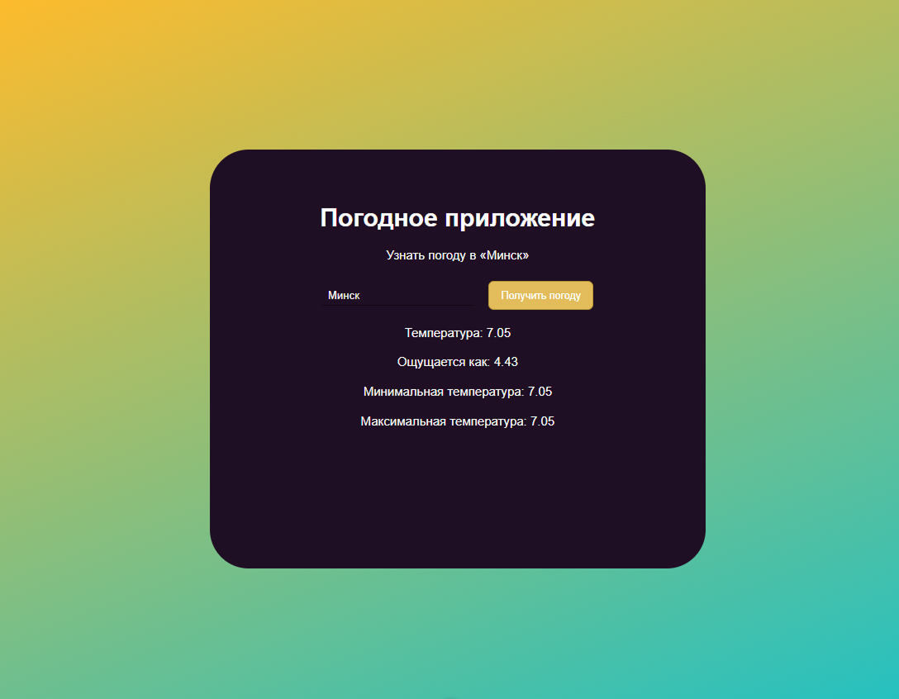

# $\color{teal}\textsf{Weather app}$

$\color{limegreen}\text{Учебная работа}$

## $\color{mediumblue}\text{Описание работы }$:

Приложение для определения погоды в любом городе по его названию.

Работа основана на YouTube-курсе ["Школа itProger"](https://www.youtube.com/@itproger) , ["Изучение Vue JS с нуля"](https://www.youtube.com/watch?v=gc4mdM1CcNo&list=PLDyJYA6aTY1lwiVmcFFb7g0dRehAXmWUn&index=6)

**Цели и задачи работы :**

❗Знакомство с фреймворком Vue 3

❗Базовая структура Vue проекта

❗Применение функционала во Vue-компонентах

❗Подключение дополнительных библиотек для работы с Vue

❗Взаимодействие с API и получение данных из него для отображения во Vue-приложении

🎯 $\color{mediumblue}\textsf{Основная задача}$ - изучение Vue.js

---

Результат работы -> [**Git pages**](https://artiom-work.github.io/vue-app-weather/)

---

## $\color{mediumblue}\text{Технологии, инструменты и способы вёрстки }$:

✅ Flexbox
✅ Git
✅ VS Code
✅ Vite
✅ Vue 3
✅ Axois
✅ OpenWeather API
✅ Node.js
✅ Hover/active-эффекты

---

## $\color{mediumblue}\text{Дополнительное описание изучения:}$

💡Создание Vue-проекта

💡Подключение общих стилей

💡Структура Vue-компонента

💡Работа с переменными во Vue

💡Computed свойства

💡Обработчики событий

💡Обработка данных пользователя

💡Создание методов

💡Условия и операторы во Vue

💡Работа с API (OpenWeather): получение и отображение информации о погоде

💡Использование библиотеки Axios для обработки данных с API

💡Развёртывание Vue-приложения на GitHub Pages
